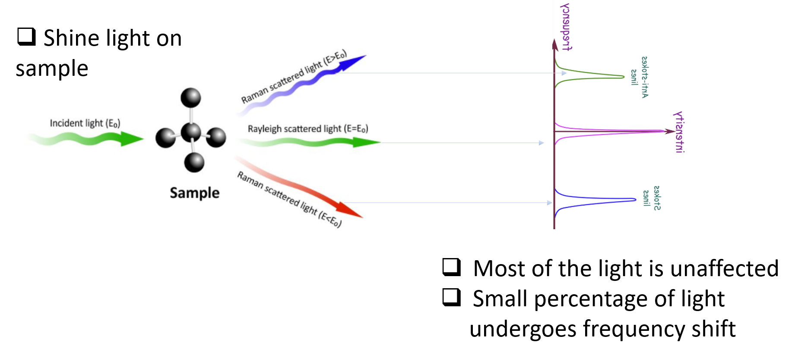

# Rapid COVID-19 Diagnosis using Raman Spectroscopy and Machine Learning
## Problem Context
Real time polymerase chain reaction (RT-PCR) as a current technology for diagnosing COVID-19 is not without limitations. Though sensitive, 
it is sophisticated has to be conducted in a controlled laboratory environment resulting to increased turn arround time.
Rapid and sensitive diagnostic capability is critical to effectively mitigate pendemics. An alternative technology that is 
both sensitive and fast is in current demand to tackle current pendemic crisis as well as any potential future pendemics.

## Proposed solution

We propose the use Machine Learning coupled with Raman spectroscopy as a safe, rapid, and efficient method for diagnosing COVID-19. 

## Dataset and Employed ML models

Using dataset consisting of Raman spectra of serum samples collected from 150 patients and 150 healthy control individuals, 
we develop a machine learning model based on Logistic regression, decision trees and Random Forest to seamlessly detect COVID-19., 
